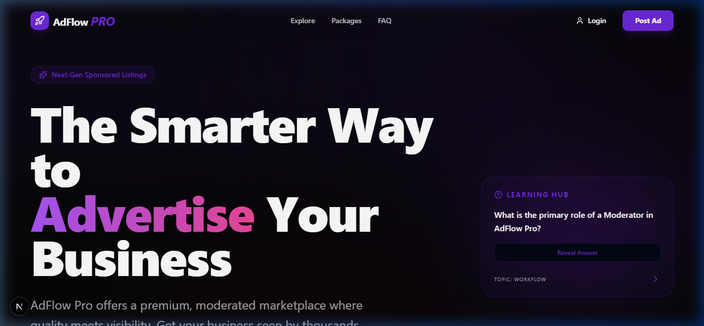
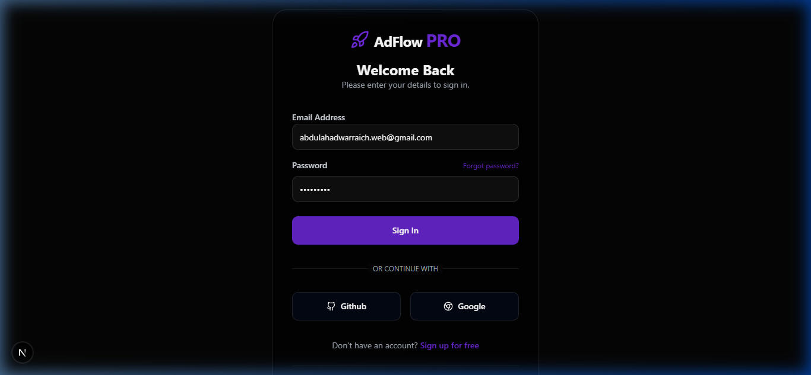
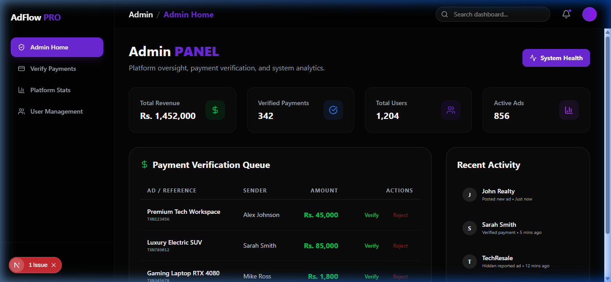
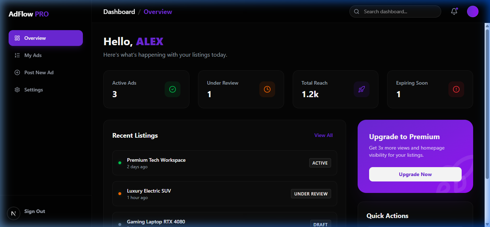

# AdFlow Pro - Mid-Term Project 🚀


**AdFlow Pro** is an advanced marketplace and advertising flow management platform built as a Mid-Term Project. It utilizes the bleeding-edge Next.js 16 App Router, React 19, and Supabase SSR to deliver a hyper-fast, secure, and beautiful role-based system for Admins, Sellers, and Buyers.

🚀 **Live Demo:** [https://mid-term-project-rosy.vercel.app/](https://mid-term-project-rosy.vercel.app/)

---

## 🌟 Key Features

*   **Role-Based Access Control (RBAC):** Secure, distinct dashboards tailored for `Admin`, `Seller`, and `Buyer` roles.
*   **Cutting-Edge Authentication:** Powered by `@supabase/ssr` running natively through Next.js 16 Node Proxy for completely secure and seamless session validation.
*   **Beautiful UI/UX:** Styled with **Tailwind CSS v4** and animated perfectly with **Framer Motion**.
*   **Admin Management Panel:** A centralized hub to oversee platform activity, manage sellers/buyers, and configure the system.
*   **Bulletproof Routing:** Advanced global proxy configuration ensuring users can never bypass authentication or visit unauthorized panels.

---

## 📸 Screenshots

*(Add your screenshots to the `screenshots/` folder to display them here!)*

### 1. Home / Landing Page


### 2. Secure Login System


### 3. Admin Dashboard


### 4. Seller & Buyer Panels


---

## 🛠️ Technology Stack

| Category         | Technology Used                                                                 |
| ---------------- | ------------------------------------------------------------------------------- |
| **Framework**    | [Next.js 16](https://nextjs.org/) (App Router + Node Proxy)                     |
| **Frontend**     | [React 19](https://react.dev/), [React DOM](https://react.dev/)                 |
| **Styling**      | [Tailwind CSS v4](https://tailwindcss.com/), `clsx`, `tailwind-merge`           |
| **Animations**   | [Framer Motion](https://www.framer.com/motion/)                                 |
| **Auth & DB**    | [Supabase SSR](https://supabase.com/docs/guides/auth/server-side/nextjs)        |
| **Icons**        | [Lucide React](https://lucide.dev/)                                             |

---

## 🚀 Getting Started

Follow these instructions to run the project locally on your machine.

### Prerequisites
Make sure you have [Node.js](https://nodejs.org/) installed along with a [Supabase](https://supabase.com/) project.

### 1. Clone the repository
```bash
git clone https://github.com/Abdulahad-web-dev/Mid-Term-Project.git
cd Mid-Term-Project
```

### 2. Install dependencies
```bash
npm install
```

### 3. Configure Environment Variables
Create a `.env.local` file in the root directory and add your Supabase credentials:
```env
NEXT_PUBLIC_SUPABASE_URL=your-supabase-project-url
NEXT_PUBLIC_SUPABASE_ANON_KEY=your-supabase-anon-key
```

### 4. Run the Development Server
```bash
npm run dev
```

Open [http://localhost:3000](http://localhost:3000) with your browser to see the result!

---

## 🌩️ Deployment

This project is configured and optimized for zero-config deployment on [Vercel](https://vercel.com/). 

Ensure you add `NEXT_PUBLIC_SUPABASE_URL` and `NEXT_PUBLIC_SUPABASE_ANON_KEY` to your Vercel Project Environment Variables *before* deploying, or trigger a Redeploy if you add them later.

---

**Developed with ❤️ by Abdul Ahad (Abdulahad-web-dev)**
