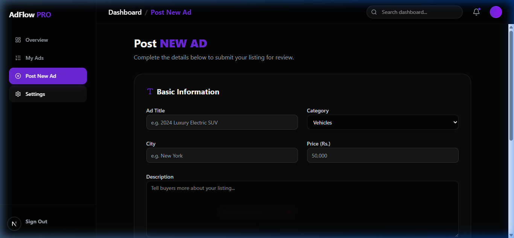
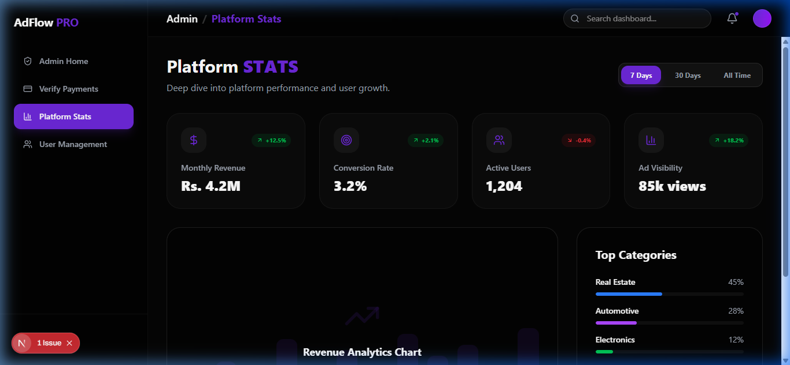

# AdFlow Pro - The Next-Gen Advertising Marketplace 🚀


**AdFlow Pro** is an ultra-premium, high-performance marketplace platform designed to revolutionize how ads are posted, managed, and discovered. Built as a Mid-Term Project, it pushes the boundaries of modern web development using **Next.js 16 (App Router)**, **React 19**, and **Supabase SSR**. 

AdFlow Pro features a sophisticated role-based ecosystem, delivering tailored experiences for **Admins**, **Moderators**, **Sellers**, and **Buyers** through a futuristic "Glassmorphic" UI/UX.

🚀 **Live Environment:** [https://mid-term-project-rosy.vercel.app/](https://mid-term-project-rosy.vercel.app/)
📱 **Android App (APK):** [Direct Download AdFlow-Pro.apk](https://github.com/Abdulahad-web-dev/Mid-Term-Project/raw/main/public/AdFlow-Pro.apk)

### 🔑 Demo Credentials

To explore the platform's role-based dashboards immediately, use these credentials:

| Role       | Email                            | Password    |
| ---------- | -------------------------------- | ----------- |
| **Admin**  | `abdulahadwarraich.web@gmail.com`| `Ahad@9696`  |
| **Seller** | `abdulahad.web96@gmail.com`      | `12345678`  |
| **Buyer**  | `abdulahad.web9@gmail.com`       | `12345678`  |

---

## 📸 Platform Screenshots

### 🏠 Home / Landing Page


### 🔑 Secure Authentication


### 📈 Seller Dashboard


### 📝 Post New Ad


### 👑 Admin Overview


### 📊 Platform Analytics


---

## 🧭 Project Architecture & Pages

AdFlow Pro is structured to handle complex user flows with dedicated interfaces for every role.

### 🏠 1. Landing Page (`/`)
The gateway to the ecosystem. It features a high-impact hero section, real-time platform statistics (10k+ Ads, 50k+ Users), and a curated selection of "Featured Listings."
*   **Key Tech:** Framer Motion scroll-reveal animations, responsive container grids.

### 🛡️ 2. Authentication Hub (`/login`, `/register`)
A secure, unified entry point that handles role-assignment and session management.
*   **Roles Supported:** `Seller`, `Buyer`, `Moderator`, `Admin`.
*   **Security:** Full Supabase SSR integration via a custom Node Proxy for bulletproof session validation.

### 🔍 3. Public Marketplace (`/explore`)
The primary destination for **Buyers**. A powerful interface to discover listings across multiple categories.
*   **Features:** Real-time search, category filtering (Tech, Real Estate, Vehicles, etc.), and multi-option sorting (Price, Newest, Popular).

### 📈 4. Seller Dashboard (`/dashboard`)
The command center for **Sellers**. Provides an overview of active listings and ad performance.
*   **Features:** Quick-stat cards (Reach, Active Ads, Expiring soon), Recent listing history, and Premium upgrade calls-to-action.
*   **Quick Actions:** One-click navigation to "Post New Ad."

### 📝 5. Ad Submission Portal (`/dashboard/submit`)
A streamlined, validation-rich form for Sellers to push new content to the marketplace.
*   **Features:** Category selection, photo uploads, pricing strategy, and city-based tagging.

### 👑 6. Admin Panel (`/admin`)
High-level governance for platform owners.
*   **Features:** System health monitoring, total revenue analytics, user growth tracking, and the **Ad Approval Queue** for verifying new listings.

### ⚖️ 7. Moderator Panel (`/moderator`)
The quality control hub.
*   **Features:** Queue management for reported listings and content moderation tools to ensure a safe marketplace environment.

---

## 🌟 Key Features

*   **Role-Based Access Control (RBAC):** Secure, distinct dashboards tailored for every user level.
*   **Modern Authentication:** Powered by `@supabase/ssr` running through a high-performance proxy.
*   **Premium UI/UX:** A "10x" design aesthetic featuring **Glassmorphism**, vibrant gradients, and high-velocity micro-interactions.
*   **Real-time Analytics:** Live tracking of ad reach and platform revenue.
*   **Responsive Excellence:** Completely optimized for Desktop, Tablet, and Mobile devices.

---

## 🛠️ Technology Stack

| Category         | Technology Used                                                                 |
| ---------------- | ------------------------------------------------------------------------------- |
| **Framework**    | [Next.js 16](https://nextjs.org/) (App Router + Proxy Architecture)             |
| **Core**         | [React 19](https://react.dev/), [TypeScript](https://www.typescriptlang.org/)   |
| **Styling**      | [Tailwind CSS v4](https://tailwindcss.com/) (Next-Gen CSS framework)            |
| **Animations**   | [Framer Motion](https://www.framer.com/motion/) (Fluid UI transitions)          |
| **Auth & DB**    | [Supabase SSR](https://supabase.com/) (PostgreSQL + Secure Sessions)            |
| **Components**   | [Radix UI](https://www.radix-ui.com/), [Lucide](https://lucide.dev/)            |

---

## 🚀 Getting Started

### 1. Clone & Install
```bash
git clone https://github.com/Abdulahad-web-dev/Mid-Term-Project.git
cd Mid-Term-Project
npm install
```

### 2. Environment Setup
Create a `.env.local` file:
```env
NEXT_PUBLIC_SUPABASE_URL=your_project_url
NEXT_PUBLIC_SUPABASE_ANON_KEY=your_anon_key
```

### 3. Launch
```bash
npm run dev
```

---

**Developed with ❤️ by Abdul Ahad (Abdulahad-web-dev)**

